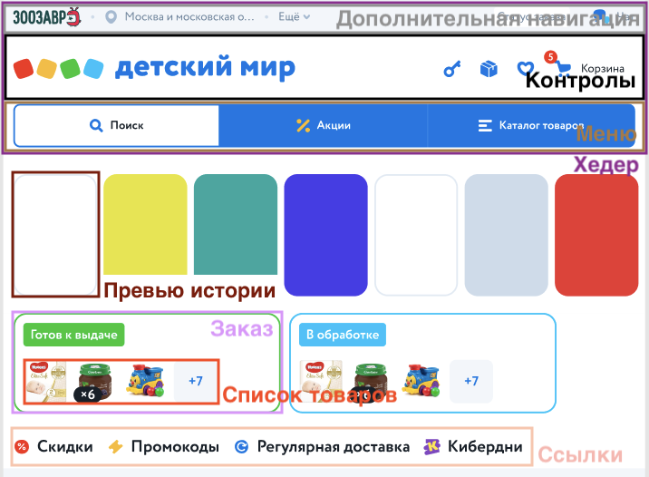

= Компоненты

Описание компонентов сайта detmir.ru

== Хедер

Шапка сайта

Блок включает в себя <<Дополнительная навигация, дополнительную навигацию>>, <<Контролы, контролы>> и <<Меню, меню>>

== Дополнительная навигация

Блок с дополнительной навигацией по сайту

== Контролы

Блок с пользовательскими элементами управления

== Меню

Основное меню сайта, группа ссылок, упрощающих навигацию по каталогу сайта

== Превью истории

Превью истории - картинка, информирующая о ее содержании

== Заказ

Краткая информация о заказе пользователя

== Список товаров

Блок с краткой информацией о товарах в заказе

== Ссылки

Блок с элементами, указывающими на определенный раздел сайта

=== Схема

== Карусель

Блок прокручивающий какое-либо содержимое

== Контейнер

Блок, которому можно задать заголовок/содежимое/фон/кнопку

== Кнопка

Элемент взаимодействия с пользователем

== Иконка

Маленькая, часто встречающаяся картинка (SVG)

== Карточка товара

Блок с краткой информацией о товаре

== Карточка категории

Блок с краткой информацией о категории

== Карточка бренда

Блок с краткой информацией о бренде

== Лейбл

Элемент содержащий промо информацию о товаре

== Баннер

Элемент содержащий информацию рекламного харакетера

== Баннеры

Блок с баннерами

=== Схема

image::img/main.png[width=300,link='images/main.png']

== Футер

Подвал сайта

Включает в себя блоки <<Социальные сети, социальные сети>>, <<Навигация, навигация>>, <<Информация, информация>>

== Социальные сети

Блок со ссылками на социальые сети

== Навигация

Навигациаонные ссылки в футере

== Информация

Блок с дополнительной информацией - способы оплаты, контакты, копирайт

=== Схема

image::img/footer.png[width=400,link='images/footer.png']
